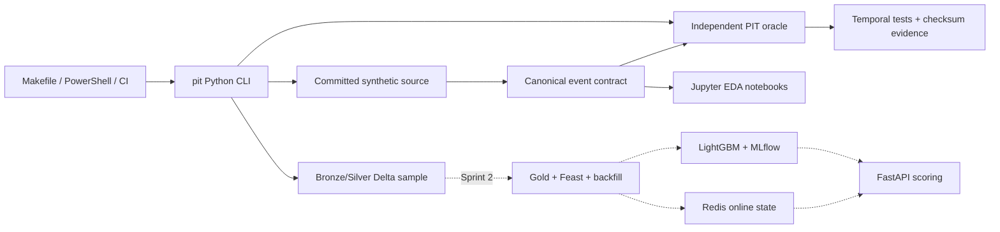

# Architecture v1

This document distinguishes the implemented Sprint 1 slice from the intended six-week system.

## Implemented boundaries

- Control plane: Makefile, PowerShell companion, Python CLI, CI.
- Contract plane: event/entity/spec/manifest Pydantic schemas.
- Correctness plane: hand-calculated expected vectors and readable oracle.
- Exploration plane: Jupyter notebooks import reusable code from `src/`.
- Lakehouse plane: versioned synthetic Bronze/Silver Delta tables with labels separated,
  logical checksums, and old-version time-travel verification.
- Infrastructure plane: localhost-only Redis, MLflow, and optional Jupyter Compose services.

## Trust and data boundaries

Kaggle credentials and raw data remain outside Git. Synthetic fixtures are public and
committed. Runtime manifests/artifacts and service volumes are ignored. Notebook code may
explore results but may not become the sole implementation of temporal logic.

## Not built yet

Full-data Bronze/Silver ingestion, Gold Delta writers, Feast retrieval, backfill state machine,
materialization, training, model registry aliases, FeatureProvider, scoring, replay parity,
monitoring, and cloud deployment are planned. Their arrows are dashed so this diagram cannot
be mistaken for architecture-as-built evidence.
