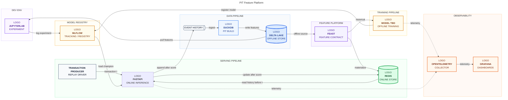

# PIT Feature Platform — High-Level Architecture

Replace each `LOGO` placeholder with the corresponding official logo when needed.

```mermaid
---
title: PIT Feature Platform
---
flowchart LR
  subgraph DEV_ENV["DEV ENV"]
    Jupyter["LOGO<br/><b>JUPYTERLAB</b><br/>EXPERIMENT"]
  end

  subgraph DATA_PIPE["DATA PIPELINE"]
    direction LR
    Data@{ shape: das, label: "EVENT HISTORY" }
    Build["LOGO<br/><b>DUCKDB</b><br/>PIT BUILD"]
    Delta[("LOGO<br/><b>DELTA LAKE</b><br/>OFFLINE STORE")]
    Data -->|ingest| Build
    Build -->|write features| Delta
  end

  subgraph FEATURE_PLATFORM["FEATURE PLATFORM"]
    Feast["LOGO<br/><b>FEAST</b><br/>FEATURE CONTRACT"]
  end

  subgraph TRAIN_PIPE["TRAINING PIPELINE"]
    Train["LOGO<br/><b>MODEL TBD</b><br/>OFFLINE TRAINING"]
  end

  subgraph MODEL_REGISTRY["MODEL REGISTRY"]
    MLflow["LOGO<br/><b>MLFLOW</b><br/>TRACKING / REGISTRY"]
  end

  subgraph SERVING_PIPE["SERVING PIPELINE"]
    direction LR
    Producer["<b>TRANSACTION PRODUCER</b><br/>REPLAY DRIVER"]
    Redis[("LOGO<br/><b>REDIS</b><br/>ONLINE STORE")]
    API["LOGO<br/><b>FASTAPI</b><br/>ONLINE INFERENCE"]
    Producer -->|transaction t| API
  end

  subgraph OBSERVABILITY["OBSERVABILITY"]
    direction LR
    OTel["LOGO<br/><b>OPENTELEMETRY</b><br/>COLLECTOR"]
    Grafana["LOGO<br/><b>GRAFANA</b><br/>DASHBOARDS"]
    OTel -->|telemetry| Grafana
  end

  Delta -->|offline source| Feast
  Delta -->|pull features| Jupyter
  Jupyter -->|log experiment| MLflow

  Feast -->|historical| Train
  Train -->|register model| MLflow
  MLflow -->|load champion| API

  Feast -->|materialize| Redis
  Redis -->|read history before t| API
  API -->|update after score| Redis
  API -->|append after score| Data

  Train -.->|telemetry| OTel
  API -.->|telemetry| OTel

  classDef source fill:#F8FAFC,stroke:#64748B,stroke-width:2px,color:#0F172A
  classDef dev fill:#FAF5FF,stroke:#8B5CF6,stroke-width:2px,color:#4C1D95
  classDef compute fill:#EFF6FF,stroke:#3B82F6,stroke-width:2px,color:#1E3A8A
  classDef offline fill:#DBEAFE,stroke:#2563EB,stroke-width:3px,color:#1E3A8A
  classDef contract fill:#F5F3FF,stroke:#7C3AED,stroke-width:2px,color:#4C1D95
  classDef model fill:#FFFBEB,stroke:#D97706,stroke-width:2px,color:#78350F
  classDef online fill:#DCFCE7,stroke:#16A34A,stroke-width:3px,color:#14532D
  classDef observe fill:#FFF7ED,stroke:#EA580C,stroke-width:2px,color:#7C2D12

  class Data,Producer source
  class Jupyter dev
  class Build compute
  class Delta offline
  class Feast contract
  class Train,MLflow model
  class Redis,hI online
  class OTel,Grafana observe

  style DEV_ENV fill:#FEFBFF,stroke:#C4B5FD,stroke-width:1px
  style DATA_PIPE fill:#F8FAFC,stroke:#93C5FD,stroke-width:1px
  style FEATURE_PLATFORM fill:#FAF5FF,stroke:#A78BFA,stroke-width:1px
  style TRAIN_PIPE fill:#FFFEF7,stroke:#FCD34D,stroke-width:1px
  style MODEL_REGISTRY fill:#FFFEF7,stroke:#F59E0B,stroke-width:1px
  style SERVING_PIPE fill:#F7FFF9,stroke:#86EFAC,stroke-width:1px
  style OBSERVABILITY fill:#FFF9F5,stroke:#FDBA74,stroke-width:1px
```
