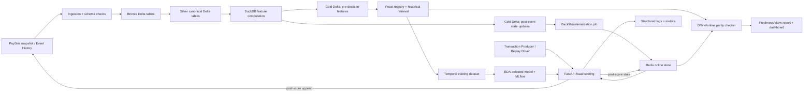

# ĐỀ XUẤT ĐỀ TÀI

## Thiết kế và đánh giá nền tảng đặc trưng đúng theo thời điểm trên data lakehouse cho phát hiện gian lận thời gian thực

**Tên tiếng Anh:** *Design and Evaluation of a Lakehouse-Backed Point-in-Time Correct Feature Platform for Real-Time Fraud Detection*

**Tên rút gọn:** PIT Fraud Feature Platform
**Định hướng:** Cloud MLOps – Data Platform – ML Systems – Fintech
**Thời gian:** 6 tuần – 3 sprint
**Dataset chính:** IEEE-CIS Fraud Detection
**Paper định hướng:** Liu et al., *Optimizing Data Pipelines for Machine Learning in Feature Stores*, PVLDB 2023
**Ràng buộc:** CPU-first, zero-budget, không phụ thuộc AWS/Azure, không yêu cầu Spark/Kubernetes/GPU

---

## TL;DR

- Đề tài không nhằm xây model fraud detection tốt nhất. Đóng góp chính là chứng minh dữ liệu dùng để train và dữ liệu lấy lúc serving tuân thủ cùng semantics theo thời gian.
- PaySim là EDA-first workload; IEEE-CIS và Home Credit chỉ là ADR-gated alternatives. Đề tài là **adapt-and-evaluate**, không claim tái lập toàn bộ FeathrPO hay con số speedup 3×.
- Ba invariant trung tâm: **không đọc tương lai**, **offline/online parity**, và **backfill tái lập được**.
- Ablation bắt buộc: pipeline ngây thơ/leaky so với pipeline PIT-correct; random split so với temporal split; full backfill so với incremental backfill; unpartitioned CSV so với partitioned Parquet.
- Stack mặc định: Delta Lake (`delta-rs`) trên Parquet làm lakehouse table format, DuckDB cho offline computation, Feast làm contract mỏng, Redis/Upstash cho online store, model TBD sau PaySim EDA + MLflow cho training/evaluation, FastAPI cho scoring, và Docker Compose + Makefile + GitHub Actions cho reproducibility. OTel Collector/Prometheus/Grafana là optional Sprint 3 trên VPS/ops boundary riêng.
- Lakehouse không phải module trang trí: Delta commit version là một phần của `dataset_snapshot_id`; ACID commit ngăn partial backfill, time travel ghim training run vào đúng snapshot, schema enforcement chặn drift và `MERGE`/partition overwrite hỗ trợ late-data correction.
- Full dataset và batch computation chạy local. Cloud chỉ giữ feature state/model nhỏ và host API CPU serverless bằng Modal + Upstash khi tài khoản sử dụng được. Fallback là local Docker Compose; public cloud không phải điều kiện nghiệm thu.
- Không dùng Spark hoặc Kubernetes trong must-have. Với khoảng 590 nghìn transaction train và tập feature được project xuống 20–40 cột, single-node DuckDB phù hợp hơn với giới hạn 6 tuần.
- Thành công không được đo bằng số công nghệ. Thành công được đo bằng future-read violation bằng 0, parity mismatch bằng 0 trong tolerance, backfill checksum ổn định, injected skew được phát hiện, và toàn bộ flow chạy lại bằng command chuẩn.

---

## 1. Vấn đề và persona

### 1.1. Persona

**ML engineer hoặc data scientist phụ trách một model fraud scoring** cần tạo training dataset và đưa model ra online serving trong khi dữ liệu giao dịch thay đổi theo thời gian.

### 1.2. Problem statement

> ML engineer gặp khó khăn khi tạo feature lịch sử cho fraud model và phục vụ đúng các feature đó tại thời điểm inference; hiện họ thường viết riêng SQL/notebook cho training và code Python/Redis cho serving, dẫn đến future leakage, training-serving skew, backfill không tái lập và metric offline cao giả tạo.

### 1.3. Tảng băng trôi

- **Triệu chứng:** model có ROC-AUC tốt trong notebook nhưng chất lượng giảm khi chạy online.
- **Nguyên nhân gốc:** timestamp semantics, entity definition, window boundary, feature version và materialization watermark không được quản lý như một data contract.
- **Outcome:** một feature vector có thể được truy nguyên tới đúng entity, cutoff time, feature definition version và source snapshot; cùng input và cutoff phải tạo cùng output.

### 1.4. The Die Test

Nếu bỏ PIT correctness, fraud model vẫn có thể chạy nhưng kết quả đánh giá không còn đáng tin. Nếu bỏ offline/online parity, model online có thể nhận feature khác lúc train. Vì vậy hai thuộc tính này là **must-have correctness properties**, không phải feature trang trí.

---

## 2. Mối quan hệ với paper gốc

Paper PVLDB 2023 xem feature store như một “DBMS for ML” và tập trung tối ưu các pipeline point-in-time join bằng:

1. reuse các feature đã materialize;
2. semijoin reduction;
3. lựa chọn data layout dựa trên cost model;
4. tích hợp các tối ưu vào FeathrPO trên Spark/Azure Synapse.

Paper đánh giá trên TPCx-AI use case 7/10, Favorita và một e-commerce dataset; paper **không dùng IEEE-CIS**. Hạ tầng paper gồm Spark cluster nhiều node và dataset feature source lên tới hàng chục hoặc hàng trăm triệu dòng, vượt scope và tài nguyên của đề tài này.

### 2.1. Phần kế thừa

- PIT join là primitive trung tâm để tạo training dataset đúng theo thời gian.
- Data layout và materialized result ảnh hưởng lớn tới thời gian backfill.
- Reuse không phải lúc nào cũng nhanh hơn; cần benchmark thay vì mặc định tối ưu.
- Chạy nhiều window feature tạo cơ hội reuse computation.

### 2.2. Phần thích nghi

- Thay FeathrPO + distributed Spark bằng Feast + DuckDB single-node.
- Thay cost-based optimizer/BILP bằng ablation có kiểm soát: full scan, partition pruning và incremental reuse.
- Bổ sung offline/online parity, freshness, skew injection và replay-based serving; đây không phải trọng tâm đánh giá chính của paper.
- Dùng IEEE-CIS làm fraud workload và tạo entity/time contract rõ ràng.

### 2.3. Không được claim

- Không claim reproduce FeathrPO.
- Không claim đạt speedup 3× của paper.
- Không claim IEEE-CIS có user identity hoặc ingestion timestamp thật.
- Không claim cloud production scale hay real-time fraud prevention thực tế.

---

## 3. Câu hỏi nghiên cứu và giả thuyết

### RQ1 — Point-in-time correctness

Làm thế nào tạo feature lịch sử sao cho mỗi transaction chỉ sử dụng các event đã tồn tại trước cutoff của transaction đó?

**H1:** pipeline PIT-correct sẽ đạt future-read violation bằng 0; pipeline leaky cố ý sẽ cho metric model khác và thể hiện rủi ro đánh giá quá lạc quan.

### RQ2 — Offline/online parity

Cùng một feature contract có tạo feature nhất quán giữa historical retrieval dùng cho training và online retrieval dùng cho serving không?

**H2:** với feature tất định và cùng version, replay tới cùng watermark sẽ cho mismatch rate bằng 0 trong tolerance số thực đã định nghĩa.

### RQ3 — Reproducible backfill

Backfill theo range trên lakehouse có thể atomic, idempotent, resume được và tạo cùng artifact khi input/table version/cutoff không đổi không?

**H3:** backfill có Delta transaction version, manifest, partition và deterministic ordering sẽ tạo cùng row count/schema/checksum; time travel về exact input snapshots sẽ tái tạo training artifact cũ.

### RQ4 — Chi phí của correctness

Partitioned Parquet và incremental reuse giảm thời gian/bytes scanned đến mức nào so với full recompute trên IEEE-CIS?

**H4:** incremental backfill có lợi khi delta nhỏ; lợi ích phải được đo theo selectivity và không được giả định luôn đúng.

---

## 4. Dataset và các giới hạn bắt buộc phải xử lý

### 4.1. Dữ liệu sử dụng

IEEE-CIS Fraud Detection gồm transaction table và identity table nối qua `TransactionID`. Train set có nhãn `isFraud`; test set không có nhãn công khai nên model evaluation sử dụng chronological split bên trong train set.

Các nhóm field dự kiến:

- `TransactionID`, `TransactionDT`, `TransactionAmt`, `ProductCD`;
- `card1`–`card6`, `addr1`, `addr2`, email domain;
- các nhóm anonymized `C*`, `D*`, `M*`, `V*` được profile để hiểu schema/missingness;
- identity fields chỉ dùng khi độ phủ và semantics phù hợp.

Kết quả correctness chính chỉ dùng các field có availability tại decision time có thể bảo vệ được. Các cột engineered/anonymized `C*`, `D*`, `V*` không được tự động coi là leakage-safe; nếu dùng, chúng nằm trong một opaque-feature baseline riêng và không được dùng để claim end-to-end leakage guarantee.

### 4.2. Event time

`TransactionDT` là độ lệch thời gian từ một mốc không được công bố, không phải timestamp lịch thật. Dự án tạo `event_timestamp` từ một synthetic epoch cố định chỉ để bảo toàn khoảng cách và thứ tự tương đối. Không diễn giải timestamp này thành ngày kinh doanh thật.

Khi nhiều transaction có cùng `TransactionDT`, thứ tự được phá hòa bằng `TransactionID` và chuyển thành `ordered_event_timestamp` có độ phân giải microsecond. Mọi pipeline phải dùng cùng phép biến đổi này.

### 4.3. Entity

IEEE-CIS không cung cấp customer/card ID chuẩn. Dự án tạo `card_entity_id` bằng hash tất định từ một tuple được khóa sau EDA, dự kiến gồm `card1`, `card2`, `card3`, `card5`; missing value được canonicalize trước khi hash.

Entity này chỉ là **proxy identity**. Mọi báo cáo phải nêu rõ giới hạn này và chạy sensitivity check với ít nhất hai entity-key candidate trước khi khóa.

### 4.4. Created/ingestion time

Dataset không có ingestion timestamp thật. Pipeline chính đặt `created_timestamp = ordered_event_timestamp`. Một tập late-arrival riêng được tạo có kiểm soát để test correction/backfill; kết quả của thí nghiệm này phải được ghi là synthetic fault injection.

### 4.5. Data split

- Chỉ dùng train set có label.
- Split theo thời gian, không random, cho kết quả chính.
- Dự kiến 70% train, 15% validation, 15% test theo `ordered_event_timestamp`.
- Có embargo ít nhất bằng window lớn nhất hoặc một khoảng rút gọn có giải thích để tránh overlap không chủ ý.
- Random split chỉ xuất hiện trong ablation, không phải kết quả chính.

---

## 5. Feature contract

### 5.1. Invariant

Với transaction `e` tại cutoff `(event_timestamp, transaction_id)`, mọi event nguồn `s` dùng để tạo history feature phải thỏa:

```text
s.event_timestamp < e.event_timestamp
OR
(s.event_timestamp = e.event_timestamp AND s.transaction_id < e.transaction_id)
```

Nhãn của transaction hiện tại hoặc tương lai không bao giờ được dùng làm feature. Label-derived history feature cũng nằm ngoài must-have vì production label thường đến trễ.

### 5.2. Feature set tối thiểu

**Request-time features:**

- `log_transaction_amount`;
- `hour_of_day`, `day_of_week` trên synthetic time;
- `ProductCD` và một số card/address/device category sau encoding;
- missingness indicators cho nhóm field quan trọng.

**Historical card features:**

- transaction count trong 1 giờ, 24 giờ và 7 ngày;
- amount sum/mean/max trong 24 giờ và 7 ngày;
- time since previous transaction;
- distinct product/email/address count trong 7 ngày nếu khả thi;
- ratio của current amount so với historical mean.

MVP khóa ở khoảng 10–15 history features. Không mở rộng lên hàng trăm feature trước khi correctness suite pass.

### 5.3. Version tuple

Mỗi artifact phải mang:

```text
dataset_snapshot_id
bronze_table_version
silver_table_version
feature_table_version
entity_definition_version
feature_definition_version
code_commit
cutoff_start
cutoff_end
source_checksum
output_checksum
```

### 5.4. Pre-decision feature và post-event state

Một lỗi thiết kế dễ gặp là materialize “feature row mới nhất của training” vào online store. Feature row dùng để score transaction hiện tại phải loại transaction đó; nếu lấy row này làm state sau transaction, online store sẽ chậm một event.

Dự án tách rõ hai view được sinh từ cùng `FeatureSpec` và reducer semantics:

- **`pre_decision_features(e)`**: history ngay trước transaction `e`, dùng cho training và parity oracle;
- **`post_event_state(e)`**: state sau khi đã consume transaction `e`, dùng làm online state cho transaction kế tiếp.

Online replay tuân thủ thứ tự **query/score trước, update state sau**. Parity tại transaction `e` so sánh `pre_decision_features(e)` với online state sau khi chỉ replay các event đứng trước `e`. Feast `PushSource` có thể dùng pre-decision Gold Delta table làm batch source cho historical retrieval, trong khi replay/materializer push post-event state cùng schema vào online store. Custom materializer không được lấy trực tiếp “latest pre-decision row” rồi xem đó là post-event state.

### 5.5. Lakehouse snapshot contract

Raw archive được giữ immutable ngoài table. Các derived layers dùng Delta Lake:

- **Bronze:** transaction/identity records gần source nhất, kèm source row hash và ingestion metadata;
- **Silver:** canonical entity, ordered event time, typed request fields và label table tách biệt;
- **Gold:** pre-decision features, post-event state updates và versioned training datasets.

Mỗi training/backfill run phải ghi exact Delta table versions. Reproduce một run nghĩa là time travel về cùng Bronze/Silver/Gold versions, không phải đọc `latest` rồi hy vọng dữ liệu chưa đổi. Không `VACUUM` các version cần cho báo cáo trong thời gian dự án.

---

## 6. Kiến trúc đề xuất



### 6.0.1. Data plane và control plane

Kiến trúc được tách thành hai mặt phẳng để project thể hiện MLOps lifecycle thay vì chỉ nối các công cụ data engineering:

- **Data plane:** Bronze/Silver/Gold Delta tables, PIT feature computation, materialization, Redis retrieval và online scoring.
- **Control plane:** Makefile/CI orchestration, manifests, MLflow registry aliases, promotion/rollback gates, monitoring và audit trail.

Feature retrieval và model scoring phải tách bằng interface trong code. MVP không bắt buộc deploy chúng thành hai microservice; một FastAPI process với adapter rõ ràng đủ để đổi local Redis sang Upstash mà không sửa scoring contract.

Model lifecycle tối thiểu:

```text
training run -> candidate -> correctness/parity/schema gates
             -> champion -> deployment manifest
             -> previous retained for one-command rollback
```

Không gắn alias deployable ngay sau training. Mọi promote/rollback phải ghi model version, feature service version, Delta snapshots, code commit, actor/reason và timestamp.

### 6.1. Local full-data path

- DuckDB đọc trực tiếp CSV và project các cột cần thiết, tránh load toàn bộ data vào Pandas.
- `delta-rs` ghi Bronze/Silver/Gold Delta tables trên local filesystem; DuckDB đọc/query Delta và các Parquet data files bên dưới.
- Table partition theo synthetic date/range; Delta transaction log quản lý atomic commit, history và snapshot version.
- Feast registry, SQLite online store và local Redis đều có thể chạy bằng Docker Compose.
- MLflow dùng SQLite backend + local artifact directory.

MinIO có thể bật bằng Docker Compose profile để mô phỏng S3-compatible object storage, nhưng chỉ là should-have. Local filesystem-backed Delta vẫn là acceptance path để không kéo object-storage operations vào critical path.

### 6.2. Cloud demo path

- Modal CPU serverless host scoring API và scale-to-zero.
- Upstash Redis giữ feature vectors mới nhất của evaluation entities hoặc một curated subset.
- Model artifact và feature registry snapshot được đóng gói theo image/deployment artifact; raw IEEE-CIS không upload lên cloud.
- Full backfill/training vẫn chạy local; cloud chỉ phục vụ online path.

### 6.3. Fallback tuyệt đối

Nếu Modal hoặc Upstash không đăng ký được, `docker compose up` phải chạy API + Redis + MLflow local. Observability VPS có documented fallback bằng structured logs/raw metrics; cloud và dashboard đều không phải single point of failure của đồ án.

---

## 7. Stack và lý do chọn

| Thành phần | Lựa chọn | Lý do |
|---|---|---|
| Batch query | DuckDB | ASOF join, đọc Parquet trực tiếp, CPU single-node, không cần cluster |
| Lakehouse format | Delta Lake qua `delta-rs` | ACID commits, schema enforcement, time travel, merge/partition overwrite mà không cần Spark |
| Physical data | Parquet dưới Delta tables | Columnar, filter/projection pushdown, partition pruning |
| Feature store | Feast | Contract mỏng cho registry, historical retrieval, materialization và online retrieval; custom oracle vẫn là correctness authority |
| Local online store | SQLite hoặc Redis container | Zero setup và deterministic integration test |
| Hosted online store | Upstash Redis Free | Core Redis-compatible path, 256 MB và 500K command/tháng tại ngày kiểm tra |
| Model | TBD sau PaySim EDA | LightGBM là candidate; khóa family/config bằng temporal evidence, không tối ưu sâu |
| Experiment tracking/registry | MLflow local | Ghi params/artifacts và quản lý alias `candidate`/`champion`/`previous` có gate |
| API | FastAPI | Online feature retrieval + scoring contract rõ ràng |
| Validation | Pandera + custom temporal assertions | Schema và invariant PIT |
| Monitoring | Structured JSON + OTel instrumentation; optional VPS OTel Collector + Prometheus + Grafana | Freshness, parity, latency, error, promotion/rollback và version audit; runtime tách core Compose |
| Workflow | Python CLI + Makefile | Một command contract xuyên local/CI/cloud |
| Local infrastructure | Docker Compose | Reproducible services không cần Kubernetes |
| Optional object storage | MinIO Compose profile | Mô phỏng S3 API local; không phải must-have |
| CI | GitHub Actions | Unit, leakage fixture, parity fixture, container build |
| Cloud | Modal CPU + Upstash | Zero-budget, scale-to-zero, không cần GPU |

### 7.1. Vì sao không Spark

Paper dùng Spark vì feature source có hàng chục đến hàng trăm triệu dòng. IEEE-CIS train nhỏ hơn nhiều; phần canonical còn nhỏ hơn sau column projection. Thêm Spark lúc này chủ yếu tăng operational overhead, không chứng minh distributed scalability vì chỉ chạy local một node.

Spark/Feathr chỉ được đưa vào nice-to-have nếu core experiment hoàn tất sớm và có câu hỏi scalability rõ ràng.

### 7.2. Vì sao không Kubernetes

Hệ thống chỉ có một scoring API, một online store và vài batch jobs. Docker Compose + serverless deployment đủ để chứng minh boundary và reproducibility. Kubernetes không giải quyết correctness invariant trung tâm.

### 7.3. IaC/Deployment as Code

Artifact automation bắt buộc:

- `compose.yaml` cho local services;
- `Makefile` làm command contract;
- `feature_store.yaml` + feature definitions;
- MLflow config và migrations nếu có;
- `modal_app.py` cho cloud deployment;
- GitHub Actions workflows;
- `.env.example`, lock file và secret contract.

`compose.yaml` core chỉ khởi động Redis, MLflow và FastAPI; MinIO có thể là optional profile. Observability runtime nằm trên VPS/ops boundary riêng. Batch compute bằng DuckDB/delta-rs và training model đã chọn chạy theo command, không biến thành container thường trú.

Terraform/OpenTofu không bắt buộc vì Modal/Upstash che giấu resource layer. Chỉ thêm IaC provider nếu nền tảng được chọn expose resource lifecycle đáng quản lý.

---

## 8. Phạm vi

### 8.1. Must-have

- Data access script, checksum manifest và license/setup guide.
- Bronze/Silver/Gold Delta tables với schema, partition và snapshot contract.
- Canonical event/entity contract và synthetic fixture.
- 10–15 history features có window semantics rõ ràng.
- PIT-correct historical training dataset.
- Leaky/naive baseline để làm đối chứng.
- Chronological train/validation/test split.
- Model baseline được khóa sau PaySim EDA; LightGBM chỉ là candidate và mọi run có MLflow tracking.
- MLflow model lifecycle có `candidate`/`champion`/`previous`, promotion gate, rollback command và deployment manifest.
- Feast registry, offline retrieval và online retrieval.
- Full backfill + incremental backfill có manifest, idempotency và resume.
- Mỗi backfill/training artifact ghim exact Delta table version; time-travel reproduction pass.
- Materialization vào online store.
- FastAPI scoring endpoint trả kèm feature/model version và freshness metadata.
- Feature retrieval adapter tách khỏi scoring logic bằng contract có test.
- Offline/online parity test tại nhiều replay checkpoints.
- Freshness và skew monitoring; ít nhất một skew injection được phát hiện.
- Docker Compose, Makefile, CI và clean-room reproduction bằng synthetic fixture.
- Báo cáo experiment và giới hạn trung thực.

### 8.2. Should-have

- Modal + Upstash deployment.
- OTel Collector + Prometheus + Grafana dashboard self-host trên VPS/ops boundary riêng.
- Trace/request/run ID xuyên feature retrieval và scoring; OpenTelemetry exporter chỉ thêm nếu không ảnh hưởng core gates.
- Late-arrival correction experiment.
- Data quality/quarantine path cho bad records.
- Model promotion gate dựa trên PR-AUC, parity và data-quality checks.
- Failure injection: duplicate, missing column, stale materialization, online-store reset.
- MinIO S3-compatible storage profile và smoke test Delta table trên object-store path.

### 8.3. Nice-to-have

- TypeScript serving experiment sau khi Python prototype pass Sprint 2: Fastify + Redis adapter + ONNX Runtime Node, giữ nguyên request/response và deployment-manifest contract.
- Cross-runtime prediction parity và A/B benchmark Python selected-model/FastAPI với TypeScript ONNX/Fastify trên cùng hardware/workload.
- DVC pipeline/remote artifact store.
- SHAP/error slice analysis.
- Shadow scoring hoặc canary giữa hai model version.
- So sánh DuckDB với local Spark/Feathr trên scale factor nhân bản.
- Reuse nhiều window từ materialized daily aggregates.

### 8.4. Ngoài phạm vi

- Model fraud SOTA hoặc Kaggle leaderboard optimization.
- Deep learning, GNN hoặc Transformer cho fraud.
- Production Kafka cluster.
- Distributed Spark/YARN cluster.
- Kubernetes, multi-region, HA/SLA.
- Tái lập FeathrPO optimizer, KLL cost model hoặc BILP layout selector.
- Lakehouse catalog/compute federation lớn như Hive Metastore, Unity Catalog, Trino cluster hoặc multi-writer production governance.
- Lưu raw IEEE-CIS trên public repository/cloud storage.
- Claim user identity hoặc ingestion timestamp thật từ IEEE-CIS.

---

## 9. Experiment matrix

### 9.1. Correctness/model ablation

| ID | Feature generation | Split | Mục đích |
|---|---|---|---|
| E1 | Static request features | Temporal | Baseline không history |
| E2 | Naive full-history aggregate có future data | Random | Positive control cho leakage |
| E3 | PIT-correct history | Random | Tách ảnh hưởng join khỏi split |
| E4 | PIT-correct history | Temporal | Kết quả chính |
| E5 | E4 + injected stale/skewed online feature | Replay | Kiểm tra detector |

Model metrics:

- PR-AUC là metric chính vì label mất cân bằng;
- ROC-AUC để đối chiếu Kaggle-style baseline;
- recall tại fixed false-positive rate;
- precision/recall theo temporal slice;
- calibration hoặc Brier score nếu còn thời gian.

Không kết luận “PIT làm model tốt hơn”. PIT làm evaluation **đúng hơn**; metric thấp hơn vẫn có thể là kết quả tốt về mặt khoa học.

### 9.2. Pipeline ablation

| ID | Layout/recompute | Đo |
|---|---|---|
| P1 | CSV/full scan/full recompute | baseline runtime, peak memory, bytes read |
| P2 | Partitioned Parquet/full recompute | effect của layout/pruning |
| P3 | Partitioned Delta/full recompute | transaction-log overhead + snapshot benefit |
| P4 | Delta incremental backfill + retry/time travel | delta backfill, atomicity, idempotency và reproducibility |
| P5 | Thay đổi một feature version | invalidation scope, new table version và rollback |

Mỗi benchmark runtime chạy warm-up rồi ít nhất ba lần; báo median và dispersion, không cherry-pick lần nhanh nhất.

### 9.3. Online system tests

- Online/offline vector equality tại ít nhất 1.000 sampled entity-cutoff pairs.
- p50/p95/p99 feature retrieval và end-to-end scoring latency.
- Feature freshness lag và materialization watermark.
- Query-before-update ordering: transaction hiện tại không được tự chui vào history feature của chính nó.
- Missing entity fallback.
- Duplicate replay event.
- Online store reset rồi rematerialize.
- Stale version và schema mismatch.

---

## 10. Tiêu chí thành công

### Correctness gates

- Future-read violation: **0** trên synthetic exhaustive fixture và sampled IEEE-CIS audit.
- Target/label column không xuất hiện trong feature lineage.
- Offline/online mismatch: **0** cho integer/categorical; `abs_diff <= 1e-6` hoặc tolerance đã khóa cho float.
- Backfill cùng input/version/range tạo cùng schema, row count và checksum.
- Training run time travel về exact Delta versions tạo lại cùng training dataset checksum.
- Duplicate event không tạo double-count.

### Operational gates

- `make bootstrap`, `make data-sample`, `make backfill`, `make train`, `make test-e2e`, `make serve` chạy theo README.
- API trả `model_version`, `feature_service_version`, `feature_timestamp`, `materialization_watermark` và prediction.
- Skew injection sinh alert/report đúng.
- Clean clone chạy toàn bộ synthetic path không cần Kaggle credentials.
- Full IEEE-CIS path chạy khi user đã accept competition rules và cấu hình Kaggle token.
- Chi phí bắt buộc trong một tháng bằng 0.

### Research gates

- Báo cáo đủ E1–E5 và P1–P5 hoặc ghi rõ experiment bị loại cùng lý do.
- Phân biệt target leakage, future leakage, random-split optimism và training-serving skew.
- Không dùng accuracy làm metric chính.
- Mọi con số có config, dataset snapshot, commit và raw result artifact đi kèm.

---

## 11. Command contract dự kiến

```text
make doctor             # kiểm tra Docker, Python, disk, RAM, Kaggle token
make bootstrap          # tạo env + local services
make data-sample        # synthetic fixture không cần credential
make data               # tải IEEE-CIS sau khi accept rules
make profile            # EDA + entity/time sensitivity
make build-lakehouse    # raw CSV -> Bronze/Silver Delta tables
make lakehouse-history  # inspect Bronze/Silver/Gold Delta commits
make features           # full offline feature computation
make backfill START=... END=...
make time-travel-check RUN_ID=...
make materialize END=...
make train              # temporal split + MLflow
make promote RUN_ID=... # candidate -> champion sau gates, ghi deployment manifest
make rollback VERSION=... # phục hồi previous champion, ghi audit event
make replay-test        # offline/online parity
make inject-skew        # negative control
make serve              # local scoring API
make status             # health, versions, watermark, active champion
make logs               # component logs theo cùng command contract
make export-onnx RUN_ID=... # optional: build ONNX bundle sau Python prototype
make serve-ts            # optional Sprint 3: Fastify + Redis + ONNX Runtime
make benchmark-serving   # optional: Python vs TypeScript parity/latency/resource
make benchmark          # E1-E5, P1-P5
make deploy-cloud       # Modal + Upstash, optional
make smoke-cloud        # hosted online path
make report             # aggregate immutable experiment results
make clean-runtime      # recoverable runtime cleanup, không xóa raw data
```

---

## 12. Kế hoạch 3 sprint

### Sprint 1 — Temporal contract và feasibility (Tuần 1–2)

Mục tiêu: chứng minh dataset có thể chuyển thành event stream/entity history hợp lệ và PIT join không đọc tương lai.

Đầu ra chính:

- data profile và dataset manifest;
- entity/time ADR;
- synthetic temporal fixture;
- Bronze/Silver Delta builder và snapshot contract;
- 10–15 feature specs;
- leaky vs PIT prototype;
- baseline temporal model;
- architecture v1 và research protocol.

Go gate: synthetic future-read violations bằng 0, full data build chạy trong resource budget, feature/entity semantics được khóa.

### Sprint 2 — Core feature platform (Tuần 3–4)

Mục tiêu: hoàn thành offline store, online store, backfill, training và serving path.

Đầu ra chính:

- Feast feature repository;
- DuckDB offline feature pipeline;
- Gold Delta feature tables + versioned snapshots;
- full/incremental backfill manifests;
- Redis materialization;
- một logical Replay Driver dùng ordered in-memory queue/iterator, xử lý xong event `t` mới phát `t+1`;
- FastAPI scoring theo thứ tự read history trước `t` -> score -> post-score Redis update/Event History append;
- local Python training CLI cho model đã chọn sau EDA; không Ray Train/Ray Tune;
- MLflow experiment tracking;
- gated model promotion/rollback + deployment manifest;
- replay parity suite;
- local deployment guide.

Go gate: `make test-e2e` chạy từ raw/sample tới prediction; backfill idempotent; parity pass; promote/rollback dùng explicit versions và manifest.

### Sprint 3 — Ablation, monitoring và cloud demo (Tuần 5–6)

Mục tiêu: tạo bằng chứng nghiên cứu và production-like reliability, không thêm feature vô hạn.

Đầu ra chính:

- E1–E5/P1–P5 experiment report;
- OTel/Prometheus/Grafana freshness/skew dashboard self-host trên VPS hoặc documented fallback;
- failure injection report;
- Modal + Upstash deployment hoặc documented fallback;
- optional TypeScript serving prototype + cross-runtime benchmark nếu entry gate pass và còn buffer;
- cost/resource report;
- architecture final, demo, README và final report.

Release gate: tất cả correctness gates pass; experiment có raw artifact; clean-room reproduction pass; demo kể được một câu chuyện nhất quán.

---

## 13. Rủi ro và kill switches

| Rủi ro | Dấu hiệu sớm | Kiểm soát/kill switch |
|---|---|---|
| Kaggle access bị chặn | Không accept rule/token không tải được | Synthetic fixture + documented manual download; không chờ quá ngày 2 |
| Entity proxy quá yếu | Phần lớn entity chỉ có một transaction | Thử 2–3 key candidate; nếu vẫn sparse, chuyển sang account/product entity hoặc PaySim fallback |
| Full feature query quá chậm/RAM cao | >30 phút hoặc swap mạnh trên sample 20% | Project cột, partition Parquet, giảm feature windows; không thêm Spark ngay |
| Delta extension/regression | DuckDB không đọc/ghi ổn định trên host | Pin DuckDB/delta-rs, chạy Linux container; dùng delta-rs Arrow path làm fallback nhưng giữ Delta log/snapshot semantics |
| Feast version/plugin lỗi | PIT/parity không pass trên fixture | Pin Feast; giữ DuckDB reference implementation; Feast là interface chứ không là single point of truth |
| Online store vượt free quota | >200 MB hoặc command burn-rate cao | Materialize curated entity subset; local Redis cho benchmark lớn |
| Model metric thấp | PR-AUC thấp nhưng pipeline đúng | Không đổi đề tài thành model tuning; model chỉ là consumer chứng minh pipeline |
| Scope creep MLOps | Thêm Kafka/K8s/Ray/Debezium/Superset trước parity | Dùng one-producer in-memory replay, FastAPI và thin Feast contract; đóng băng distributed/BI stack tới khi core gates pass |
| Backfill “đúng” nhưng không deterministic | Checksum đổi giữa rerun | Khóa ordering, float type, seed, dependency versions và checksum canonical format |
| Cloud account không usable | Modal/Upstash registration fail | Local Compose là acceptance path; quay video + tunnel nếu cần demo từ xa |
| Mentor yêu cầu reproduce paper sát | Phải dùng FeathrPO/Spark/cost optimizer | Chốt ngay tuần 0 rằng đây là adapt-and-evaluate; nếu không được, giảm scope về PIT optimizer benchmark hoặc đổi dataset/use case |

---

## 14. Sản phẩm bàn giao

1. Source code feature platform và fraud scoring service.
2. Versioned feature repository và data contracts.
3. Synthetic temporal correctness dataset.
4. Data ingestion/canonicalization/backfill pipelines.
5. Bronze/Silver/Gold Delta Lake tables, offline/online stores và materialization flow.
6. EDA-selected model + MLflow experiment artifacts.
7. Model registry aliases, promotion/rollback audit và deployment manifests.
8. Correctness, parity, freshness, skew và reliability test suites.
9. Experiment report E1–E5/P1–P5.
10. Docker Compose, Makefile, CI và optional Modal deployment definition.
11. Architecture, ADR, deployment guide, final report và demo video.

---

## 15. Giá trị cho profile

Đề tài bổ sung các bằng chứng CV hiện tại còn thiếu:

- temporal data modeling và leakage prevention;
- feature engineering lifecycle thay vì chỉ model inference;
- offline/online consistency;
- reproducible backfill và data version lineage;
- experiment tracking và temporal evaluation;
- online feature serving, freshness/skew monitoring;
- cloud-portable, zero-budget MLOps automation.

Thông điệp bảo vệ nên là:

> Tôi không chỉ train một fraud model. Tôi xây và kiểm chứng data contract bảo đảm model nhìn thấy đúng thông tin đã tồn tại tại thời điểm quyết định, rồi chứng minh training và serving dùng cùng feature semantics.

---

## 16. Nguồn chính

- [Liu et al. — Optimizing Data Pipelines for Machine Learning in Feature Stores, PVLDB 2023](https://www.vldb.org/pvldb/vol16/p4230-camacho-rodriguez.pdf)
- [IEEE-CIS Fraud Detection — Kaggle](https://www.kaggle.com/competitions/ieee-fraud-detection/data)
- [Feast Quickstart](https://docs.feast.dev/getting-started)
- [Feast offline-store functionality](https://docs.feast.dev/reference/offline-stores/overview)
- [Feast DuckDB offline store](https://docs.feast.dev/v0.51-branch/reference/offline-stores/duckdb)
- [DuckDB ASOF Join](https://duckdb.org/docs/stable/sql/query_syntax/from#as-of-joins)
- [DuckDB Parquet](https://duckdb.org/docs/stable/data/parquet/overview)
- [Delta Lake documentation](https://docs.delta.io/)
- [delta-rs Python usage](https://delta-io.github.io/delta-rs/python/usage.html)
- [DuckDB Delta extension](https://duckdb.org/docs/current/core_extensions/delta)
- [Upstash Redis pricing](https://upstash.com/pricing/redis)
- [Modal pricing](https://modal.com/pricing)
- [ONNX Runtime JavaScript](https://onnxruntime.ai/docs/get-started/with-javascript/)
- [Fastify](https://fastify.dev/)
- Le Hong Vu — *A Unified Lakehouse Architecture Supporting Both Batch and Streaming Data for E-Commerce Analytics and Recommendations*, Project Final Report, 2026 (engineering reference; không phải paper nền cho PIT correctness).
- [Customer Purchase Prediction ML System](https://github.com/bmd1905/Customer-Purchase-Prediction-ML-System) (reference cho component boundaries và local MLOps lifecycle; không clone toàn stack).
- [Reference architecture comparison và scope decision](reference-architecture-comparison.md)

Thông tin nền tảng/quota được kiểm tra ngày 2026-07-20 và phải kiểm tra lại trước Sprint 3.
