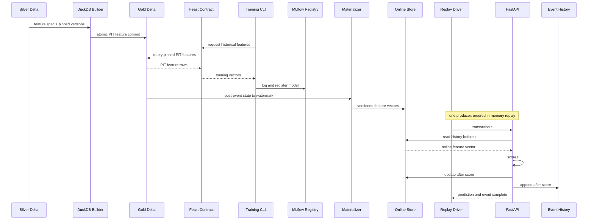

# Sprint 2 — Implementation Guide

## Core Feature Platform (Tuần 3–4)

Mục tiêu Sprint 2 là biến temporal contract của Sprint 1 thành một đường chạy hoàn chỉnh:

```text
silver data -> offline features -> historical training dataset -> model
           -> backfill/materialization -> online features -> scoring API
```

Definition of Done của sprint không phải “Feast UI mở được”. Definition of Done là cùng entity/cutoff/version tạo feature vector giống nhau ở offline reference và online replay.

Bronze/Silver/Gold là medallion layers của offline data path và phải được build bằng Python
CLI/Makefile. JupyterLab chỉ hỗ trợ EDA/experiment; synchronous FastAPI request không chạy xuyên
medallion hay DuckDB.

---

## 0. Bản đồ artifact

| ID | Artifact | Nội dung bắt buộc |
|---|---|---|
| S2-A1 | `feature_repo/` | Feast config, entity, source, feature view/service |
| S2-A2 | `src/features/build_offline.py` | optimized DuckDB computation -> Gold Delta tables |
| S2-A3 | `src/backfill/` | full/range/incremental Delta backfill + manifest |
| S2-A4 | `src/materialization/` | online-store population và watermark |
| S2-A5 | `src/training/` | temporal dataset + EDA-selected model + MLflow |
| S2-A6 | `src/serving/` | FastAPI scoring service |
| S2-A7 | `src/replay/` | one-producer ordered in-memory replay/checkpoint harness |
| S2-A8 | `tests/integration/` | end-to-end, idempotency, parity, duplicate |
| S2-A9 | `compose.yaml` | core services only: Redis, MLflow, API |
| S2-A10 | `docs/feature-lineage.md` | source -> feature -> service -> model |
| S2-A11 | `docs/local-deployment.md` | clean setup, run, teardown, recovery |
| S2-A12 | `docs/reports/sprint-2-gate.md` | gate evidence và known gaps |
| S2-A13 | `src/lifecycle/` | promotion/rollback + immutable deployment manifest |
| S2-A14 | `src/serving/feature_provider.py` | versioned feature-retrieval interface/adapters |

---

## 1. Input contract từ Sprint 1

Sprint 2 dừng ngay nếu chưa có:

- `dataset_snapshot_id`;
- entity definition version;
- event-time/tie-break rules;
- feature spec v1;
- synthetic expected vectors;
- temporal split cutoffs;
- float comparison tolerance;
- passing temporal tests.

Mọi thay đổi contract giữa sprint phải tạo ADR mới và bump version. Không sửa silent.

---

## 2. Kiến trúc build trong Sprint 2



---

## 3. T1 — Feast feature repository

Feast là control-plane contract mỏng cho entity/schema/feature service, historical retrieval và
materialization. DuckDB vẫn compute PIT features, Delta vẫn là offline source of truth, Redis vẫn
là online store, và custom oracle vẫn là correctness authority. Không dùng Feast UI làm gate.

Chỉ bỏ Feast nếu fixture integration bị block sau time-box và có ADR. Fallback phải tự cung cấp
đủ versioned `FeatureSpec`, `FeatureProvider`, Redis key/schema contract, materialization manifest
và parity gates; không thay bằng một script copy Gold sang Redis thiếu contract.

### 3.1. Configuration profiles

Tách ít nhất hai config:

- `local`: DuckDB/File offline + SQLite hoặc local Redis online;
- `hosted`: registry artifact + Upstash Redis online, chỉ kích hoạt Sprint 3.

Secret không nằm trong YAML commit. Dùng environment variable expansion hoặc generated runtime config.

### 3.2. Feast objects

- `Entity`: `card_entity` với join key đã khóa.
- `FileSource`: pre-decision Gold Delta table có `event_timestamp` và `created_timestamp` (qua Feast DuckDB offline store).
- `PushSource`: batch source trỏ vào FileSource; online write nhận post-event state từ replay/materializer.
- `FeatureView`: history feature v1 đọc PushSource, giữ cùng schema cho batch và online paths.
- `FeatureService`: `fraud_scoring_v1`, chỉ chứa feature model thực sự dùng.
- Request-time fields xử lý rõ ràng ngoài hoặc bằng on-demand feature view; không duplicate logic âm thầm.

### 3.3. Registry lifecycle

```text
feast plan/apply -> registry checksum -> feature_service_version
```

- Commit feature definitions, không commit secret.
- Registry runtime artifact có checksum.
- CI chạy `feast apply` trên temp directory/fixture.
- Removal/rename feature yêu cầu migration note.

### 3.4. Acceptance

- Feast historical retrieval trên synthetic fixture khớp expected vectors.
- `feast apply` idempotent.
- `fraud_scoring_v1` resolve đủ và đúng ordered feature names.

---

## 4. T2 — Optimized offline feature computation

### 4.0. Hai temporal views từ cùng contract

Builder tạo hai artifact có vai trò khác nhau:

- Gold Delta `pre_decision_features`: aggregate ngay trước từng transaction, dùng cho training;
- Gold Delta `post_event_state_updates`: aggregate sau khi consume từng transaction, dùng để materialize online state.

Không materialize latest `pre_decision_features` row: nó loại transaction mới nhất và khiến online state chậm một event. Hai view phải được sinh từ cùng feature spec/reducer, và fixture phải chứng minh quan hệ shift giữa chúng.

### 4.1. Hai implementation

1. **Reference implementation:** tối ưu cho correctness, chạy fixture/small sample.
2. **DuckDB implementation:** tối ưu cho full IEEE-CIS.

Hai implementation phải khớp trên fixture và random sample trước khi benchmark performance.

### 4.2. Query requirements

- Chỉ đọc partitions cần cho output range cộng lookback window.
- Strict PIT boundary theo ADR-001.
- Deterministic ordering.
- Không join label table vào feature computation.
- Persist `max_source_event_timestamp` hoặc audit sample để chứng minh cutoff.
- Dtype/output column order cố định.

### 4.3. Atomic output

Backfill ghi vào staging path:

```text
artifacts/runs/<run_id>/staging/...
```

Chỉ promote thành partition chính khi:

- validation pass;
- row count hợp lệ;
- checksum hoàn tất;
- no-future assertion pass;
- manifest ghi thành công.

Promotion là một Delta transaction hoặc partition overwrite/`MERGE` có predicate rõ. Crash trước commit không được để half-valid table snapshot; reader phải tiếp tục thấy version committed gần nhất.

---

## 5. T3 — Backfill state machine

### 5.1. States

```text
planned -> running -> validated -> committed
                    -> failed
```

Mỗi run có:

- `run_id`;
- range;
- source/feature/entity/code versions;
- attempt;
- input partitions/checksums;
- output partitions/checksums;
- source Bronze/Silver versions và committed Gold version;
- counts, timings, errors;
- previous materialization reused.

### 5.2. Idempotency key

```text
sha256(dataset_snapshot + entity_version + feature_version + start + end)
```

Cùng idempotency key:

- nếu committed và checksum khớp: no-op;
- nếu failed/staging: cleanup staging an toàn rồi resume/retry;
- nếu checksum source đổi: fail loud, không reuse artifact cũ.

Run manifest ghi Delta application/transaction identity khi writer hỗ trợ. Retry không được tạo duplicate commit hoặc hai snapshot có cùng logical backfill identity mà không có quan hệ `supersedes`.

### 5.3. Full vs incremental

- Full: build toàn range từ một pinned Silver table version.
- Incremental: chỉ build delta output range nhưng đọc lookback cần thiết, rồi partition overwrite hoặc `MERGE` vào Gold Delta table.
- Reuse: dùng materialized daily aggregates chỉ khi result khớp reference.

Không gọi một query là incremental nếu nó vẫn scan toàn bộ source. Ghi bytes/partitions read.

### 5.4. Late-arrival correction

Fault-injection path:

1. materialize tới watermark T;
2. inject event có event time < T nhưng created time > T;
3. xác định impacted range `[event_time, event_time + max_window]`;
4. backfill range đó;
5. commit Gold table version mới;
6. compare corrected checksum với clean reference và xác nhận version cũ vẫn time-travel được.

Đây là synthetic test, phải label rõ.

---

## 6. T4 — Historical dataset và training pipeline

Training chạy bằng Python CLI trên local CPU. Model family vẫn là TBD cho tới khi PaySim EDA và
temporal validation đủ evidence; LightGBM chỉ là candidate. Không dùng Ray Train hoặc Ray Tune
trong Sprint 2. Nếu cần so sánh nhẹ, chạy một candidate/config matrix nhỏ, deterministic và log
từng run vào MLflow; không mở large-scale hyperparameter search.

### 6.1. Historical retrieval

Entity dataframe cho training gồm:

```text
transaction_id
card_entity_id
ordered_event_timestamp
label_is_fraud
request-time fields
```

Feast/DuckDB gắn history features theo cutoff. Sau retrieval:

- assert row count không tăng/giảm ngoài expected missing behavior;
- assert one row/transaction;
- assert no label in feature columns;
- freeze ordered feature list.

### 6.2. Temporal split

- Split bằng cutoffs đã khóa Sprint 1.
- Fit category encoding/imputation chỉ trên train.
- Validation chọn threshold/hyperparameters.
- Test chỉ dùng một lần cho final selected config.
- Random split runs được tách experiment namespace `ablation/`, không promotion.

### 6.3. MLflow run contract

Tags bắt buộc:

```text
dataset_snapshot_id
bronze_table_version
silver_table_version
gold_feature_table_version
entity_version
feature_service_version
training_dataset_checksum
split_policy
code_commit
candidate_or_baseline
```

Artifacts:

- model;
- ordered feature names và dtypes;
- preprocessing object;
- metrics JSON;
- confusion/cost curves;
- environment lock;
- sample prediction contract.

### 6.4. Promotion gate

Model candidate chỉ được đánh dấu deployable khi:

- temporal data tests pass;
- feature parity fixture pass;
- không dùng leaky/random split artifact;
- required metrics tồn tại;
- model input contract khớp `fraud_scoring_v1`.

Không bắt buộc candidate phải thắng baseline để chứng minh platform. Nếu không thắng, report trung thực.

Candidate được log dưới alias `candidate`. Chỉ command promotion mới được thay đổi alias deployable:

```text
candidate -> champion
old champion -> previous
```

`make promote RUN_ID=...` phải:

1. chạy lại temporal, lineage, parity và model-input-contract gates;
2. resolve model version thay vì dùng `latest`;
3. ghi immutable deployment manifest gồm dataset/Delta/feature/model/code versions;
4. cập nhật aliases theo thứ tự an toàn;
5. phát audit event có reason và timestamp.

`make rollback VERSION=...` chỉ nhận version đã xuất hiện trong một deployment manifest hợp lệ. Rollback không retrain và không silently đổi feature service version.

---

## 7. T5 — Online materialization

### 7.1. Semantics

Online store giữ latest **post-event state** per entity. Materialization có global watermark T, consume các source event `<= T`, rồi push state sau event mới nhất qua Feast `PushSource`/online write path. Nó không lấy trực tiếp latest training/pre-decision row.

Materialization run phải pin một Gold Delta table version. Nếu Gold `latest` thay đổi trong lúc run, kết quả vẫn gắn với version đã resolve ban đầu.

Với một request transaction mới `e`, history feature phải phản ánh mọi event đã committed trước `e` nhưng chưa bao gồm `e`. Nếu replay mô phỏng cả scoring và ingestion, thứ tự bắt buộc là:

```text
read current online state -> score e -> commit/update state with e
```

Metadata lưu riêng hoặc cùng record:

```text
entity_id
feature_vector
feature_timestamp
materialization_watermark
feature_service_version
source_checksum
written_at
```

### 7.2. Safety rules

- Không materialize future row so với watermark.
- Older write không overwrite newer record.
- Same version/timestamp write idempotent.
- Different feature version không silently overwrite; namespace key theo service version.
- Missing entity trả defaults + explicit `feature_status`, không giả vờ fresh.

### 7.3. Local stores

Chạy hai modes:

- SQLite để deterministic/fast unit integration;
- Redis container để production-like read/write và chuẩn bị Upstash.

Parity phải pass ở cả hai nếu cả hai nằm trong supported path.

---

## 8. T6 — Replay và parity harness

### 8.1. Replay clock

Replay dùng đúng một logical Transaction Producer/Replay Driver. Input được sort bằng event time
và deterministic tie-break, giữ trong Python iterator/generator hoặc in-memory queue. Driver phát
một event, chờ scoring và post-score commit hoàn tất, rồi mới phát event kế tiếp. Không dùng
Kafka, RabbitMQ, Redis Streams hoặc service queue ngoài trong acceptance path.

Tại checkpoint T:

1. chọn transaction `e` tại cutoff T;
2. replay/materialize chỉ các event đứng trước `e`;
3. query online feature vector trước khi update bằng `e`;
4. query offline `pre_decision_features(e)` tại cùng entity/cutoff;
5. canonicalize dtype/order/null;
6. compare và log mismatch.

Sau compare/scoring mới apply `post_event_state(e)` để chuẩn bị cho transaction kế tiếp.

### 8.2. Parity result schema

```text
run_id
entity_id
cutoff
feature_name
offline_value
online_value
absolute_diff
status
offline_version
online_version
watermark
```

### 8.3. Required checkpoints

- beginning of stream;
- before/after a high-volume period;
- before/after split boundaries;
- final materialization;
- at least one same-second tie case;
- synthetic late-arrival correction.

### 8.4. Mismatch taxonomy

- value difference;
- null/default mismatch;
- dtype/rounding mismatch;
- stale online timestamp;
- wrong feature version;
- missing entity;
- duplicate/double-count;
- boundary-window mismatch.

Không sửa mismatch bằng cách tăng float tolerance trước khi xác định cause.

---

## 9. T7 — FastAPI scoring service

Feature retrieval được tách qua `FeatureProvider` interface. Local Redis, Feast SDK và hosted Upstash là adapters; scoring layer chỉ nhận versioned feature vector. MVP vẫn được deploy trong một process để tránh microservice overhead.

FastAPI/Uvicorn là reference serving runtime. Không dùng Ray Serve trong Sprint 2; chỉ đánh giá
lại sau khi correctness pass và serving benchmark chứng minh single-process/worker path là
bottleneck. Load/concurrency benchmark không được làm thay đổi replay correctness mode tuần tự.

### 9.1. Request contract

```json
{
  "transaction_id": "demo-...",
  "event_timestamp": "...",
  "card_fields": {},
  "transaction_amount": 0.0,
  "product_code": "..."
}
```

### 9.2. Response contract

```json
{
  "prediction": 0,
  "fraud_probability": 0.0,
  "decision_threshold": 0.0,
  "entity_id": "...",
  "model_version": "...",
  "feature_service_version": "...",
  "feature_timestamp": "...",
  "materialization_watermark": "...",
  "feature_status": "fresh|stale|missing",
  "request_id": "...",
  "latency_ms": {}
}
```

### 9.3. Scoring order

1. validate request;
2. derive entity ID/request features bằng shared contract;
3. retrieve history features;
4. check version/freshness;
5. build ordered model vector;
6. score;
7. emit structured log/metrics;
8. nếu chạy replay/streaming mode, update post-event state **sau** khi prediction đã được tạo; batch-serving MVP có thể tách update khỏi request path.

### 9.4. Failure policy

- Missing entity: defined cold-start defaults hoặc reject, không random fill.
- Stale features: response flag + configurable fail-open/fail-closed; demo mặc định fail-open nhưng log warning.
- Version mismatch: fail-closed.
- Online store timeout: bounded retry rồi 503; không silently dùng stale local cache nếu chưa versioned.

---

## 10. T8 — Local infrastructure

`compose.yaml` tối thiểu:

- Redis;
- MLflow tracking server;
- scoring API;
- optional MinIO profile để smoke-test Delta tables trên S3-compatible storage.

OpenTelemetry Collector, Prometheus và Grafana không nằm trong core Compose. Nếu triển khai ở
Sprint 3, chúng chạy trên VPS/ops boundary riêng; repo này chỉ giữ instrumentation và versioned
dashboard/config contract cần cho reproducibility.

### 10.1. Data persistence

- Named volume cho Redis/MLflow runtime.
- Raw/silver/artifacts bind mount read-only/read-write theo nhu cầu.
- Teardown command không xóa raw dataset mặc định.
- `make clean-runtime` chỉ xóa recoverable state đã resolve path rõ ràng.

### 10.2. Healthchecks

- Redis ping;
- MLflow `/health` hoặc equivalent;
- API `/health/live` và `/health/ready`;
- ready chỉ true khi model + online store + feature version load đúng.

---

## 11. T9 — Test suite

### Unit

- entity hash golden tests;
- ordered event timestamp ties;
- feature window boundaries;
- canonical float/null comparison;
- idempotency key;
- model input ordering.

### Integration

- Feast fixture historical retrieval;
- materialize then online retrieve;
- backfill twice, same checksum;
- append controlled batch, time travel về old Delta version và khớp old checksum;
- schema-breaking write bị chặn trước commit;
- interrupted staging then resume;
- older write cannot overwrite newer;
- model/feature version mismatch rejected;
- API happy path/missing/stale paths.

### End-to-end

```text
synthetic raw -> Bronze/Silver Delta -> Gold features -> train -> materialize
-> one-producer replay -> API score -> post-score update/append -> parity check -> report
```

E2E phải chạy bằng một command và không yêu cầu internet/Kaggle.

---

## 12. Command acceptance

```text
make bootstrap
make data-sample
make build-lakehouse DATASET=sample
make features DATASET=sample
make backfill DATASET=sample START=... END=...
make materialize DATASET=sample END=...
make train DATASET=sample
make promote RUN_ID=<sample-run>
make up
make smoke
make rollback VERSION=<known-good-version>
make replay-test DATASET=sample
make time-travel-check RUN_ID=<sample-run>
make test-e2e
make down
```

Full data dùng cùng code path, chỉ khác config/manifest.

---

## 13. Go/No-Go cuối Sprint 2

| Gate | PASS khi |
|---|---|
| G1 Feast contract | historical retrieval khớp fixture oracle |
| G2 Backfill | full/range rerun có checksum giống nhau và Delta versions được ghi |
| G3 Atomicity | failed run không để committed partial output |
| G4 Training | temporal run của model đã chọn sau EDA có MLflow artifacts đầy đủ |
| G5 Materialization | latest feature state đúng watermark/version |
| G6 Parity | mismatch bằng 0 theo tolerance trên required checkpoints |
| G7 Serving | API trả prediction + lineage/freshness metadata |
| G8 Recovery | Redis reset rồi rematerialize thành công |
| G9 Reproducibility | synthetic E2E chạy bằng một command |
| G10 Lakehouse snapshot | old run được tái tạo bằng exact Delta versions |
| G11 Model lifecycle | promote + rollback dùng explicit versions/manifests và scoring trả đúng active champion |

Nếu G6 chưa pass, Sprint 3 chỉ được làm debug/parity; không triển khai cloud hoặc dashboard để che lỗi correctness.

---

## 14. Lịch 10 ngày làm việc

| Ngày | Việc | Artifact |
|---|---|---|
| 1 | Feast repo + fixture apply/retrieve | S2-A1 |
| 2 | DuckDB feature builder -> Gold Delta, parity với reference | S2-A2 |
| 3 | Backfill state machine + atomic Delta commit | S2-A3 |
| 4 | Full/incremental/idempotency tests | S2-A3, S2-A8 |
| 5 | Historical dataset + local training CLI + MLflow candidate alias | S2-A5, S2-A13 |
| 6 | Redis materialization + watermark/version | S2-A4 |
| 7 | Replay/parity harness | S2-A7 |
| 8 | FeatureProvider boundary + FastAPI scoring + failure policies | S2-A6, S2-A14 |
| 9 | Promotion/rollback manifest, Compose, healthcheck, E2E tests | S2-A8, S2-A9, S2-A13 |
| 10 | Lineage/deployment docs + sprint gate | S2-A10–A14 |

---

## 15. Sprint 3 nhận những gì

- passing correctness/parity suite;
- immutable benchmark dataset checksums;
- MLflow baseline/candidate run IDs;
- full and incremental backfill raw timings;
- local service deployment;
- stable API/metrics schema;
- list known limitations, không giấu bằng TODO.
